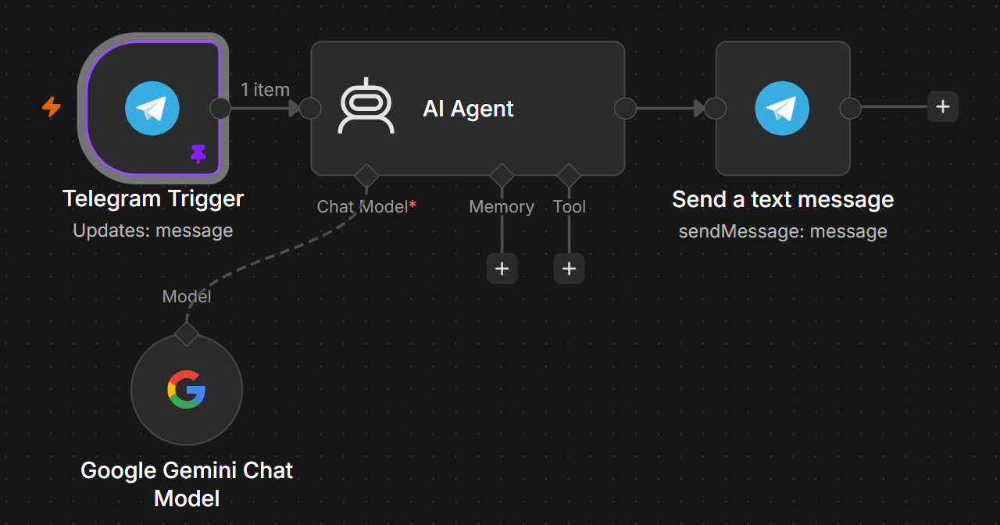
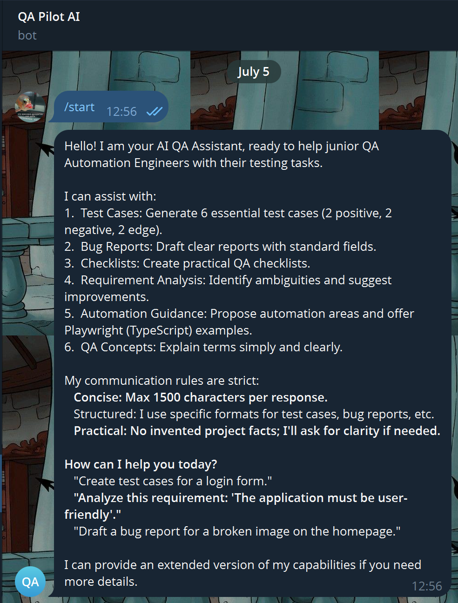
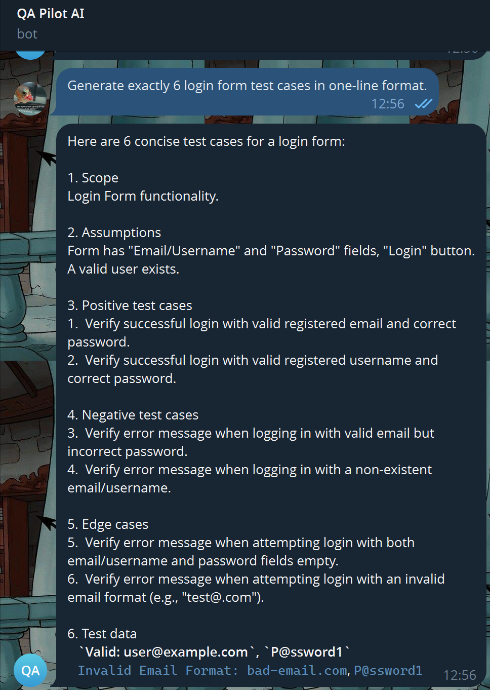
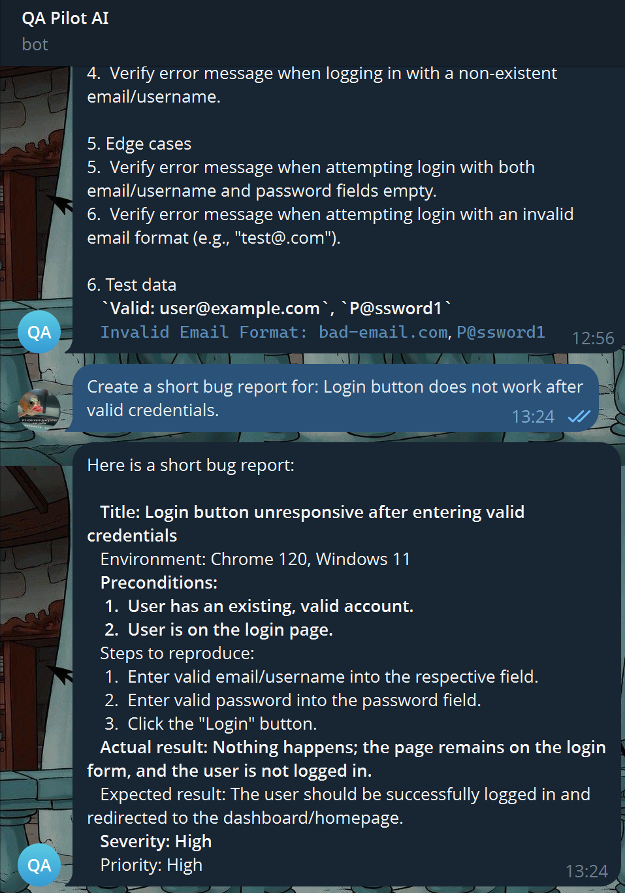
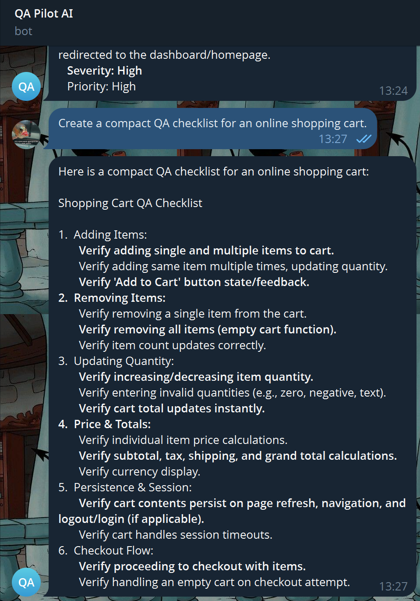

# QA Pilot AI — Telegram QA Assistant with n8n and Gemini

QA Pilot AI is an AI-powered Telegram assistant designed to support daily QA tasks for a Junior QA / QA Automation Engineer.

The bot helps generate compact test cases, draft structured bug reports, create QA checklists, analyze ambiguous requirements, suggest test data, and provide basic automation hints.

This project was built as a portfolio project to demonstrate practical no-code/low-code automation, AI assistant configuration, QA prompt design, Telegram integration, and integration testing.

---

## Tech Stack

- n8n
- Telegram Bot API
- Google Gemini Chat Model
- n8n AI Agent
- Prompt Engineering
- QA Test Design
- Integration Testing

---

## Workflow

The automation workflow is built in n8n:

```text
Telegram Trigger → AI Agent → Send a text message
                 └ Google Gemini Chat Model
```

### Workflow Logic

1. A user sends a message to the Telegram bot.
2. Telegram Trigger receives the incoming message.
3. AI Agent processes the message using the configured system prompt.
4. Google Gemini Chat Model generates the response.
5. Send a text message returns the answer back to the same Telegram chat.

API keys, bot tokens, and n8n credentials are stored inside n8n credentials and are not included in this repository.

---

## Features

- Generates positive, negative, and edge test cases
- Drafts structured bug reports
- Creates compact QA checklists
- Analyzes requirements for ambiguity
- Suggests test data and edge cases
- Provides basic Playwright / TypeScript automation hints
- Uses response length control to reduce Telegram message delivery issues
- Documents integration limitations discovered during testing

---

## Example Use Cases

### Test Case Generation

User request:

```text
Generate exactly 6 login form test cases.
```

Bot response includes:

- Scope
- Assumptions
- Positive test cases
- Negative test cases
- Edge cases
- Test data
- Risks and clarifying questions

---

### Bug Report Drafting

User request:

```text
Create a short bug report for:
Login button does not work after valid credentials.
```

Bot response includes:

- Title
- Environment
- Preconditions
- Steps to reproduce
- Actual result
- Expected result
- Severity
- Priority
- Attachments / logs

---

### QA Checklist Creation

User request:

```text
Create a compact QA checklist for an online shopping cart.
```

Bot response includes checklist areas such as:

- Adding items
- Removing items
- Updating quantity
- Price and total calculations
- Cart persistence
- Checkout flow
- Empty cart state
- Stock limitation handling

---

### Requirement Analysis

User request:

```text
Analyze this requirement for ambiguity:
"User should be able to quickly register on the website."
```

Expected bot response identifies:

- Ambiguous wording
- Missing measurable criteria
- Clarifying questions
- A more testable requirement

---

## Screenshots

### n8n Workflow



---

### Start / Bot Capabilities



---

### Test Case Generation Demo



---

### Bug Report Demo



---

### QA Checklist Demo



---

## Prompt Design

The assistant behavior is controlled through a system prompt stored in:

```text
prompts/system-message.md
```

The system prompt defines:

- QA assistant role
- Supported QA tasks
- Response length limits
- Test case structure
- Bug report structure
- Checklist format
- Requirement analysis format
- Rules for avoiding invented project-specific facts

---

## Test Scenarios

Manual test scenarios for validating the bot are stored in:

```text
test-scenarios/qa-bot-test-scenarios.md
```

Covered scenarios include:

- Bot start message
- Test case generation
- Bug report drafting
- QA checklist creation
- Requirement analysis
- Response length control
- External API limitation handling

---

## QA Improvements Implemented

During testing, the bot initially generated long responses that could exceed Telegram message delivery limits.

To improve reliability, response length rules were added to:

- the system prompt;
- the n8n output expression before sending Telegram messages.

This helped make bot responses more suitable for Telegram and reduced the risk of message delivery failures.

---

## Known Limitations

During testing, the workflow exposed several external integration limitations:

- Gemini API returned `429 Too Many Requests` when the free-tier quota was exceeded.
- Gemini API returned temporary `503 Service Unavailable` during high demand.
- Long AI responses could exceed Telegram message delivery limits.

These are external API and platform limitations. The Telegram trigger and n8n message routing were configured successfully.

---

## Security Notes

Sensitive credentials are not included in this repository.

The following values must be stored only in n8n credentials or secure environment settings:

- Telegram bot token
- Google Gemini API key
- OpenAI API key, if used
- n8n credentials

If a token is accidentally exposed, it should be revoked and regenerated immediately.

---

## What I Learned

- How to build an AI-powered Telegram workflow in n8n
- How to connect Telegram Trigger, AI Agent, Gemini Chat Model, and Telegram Send Message
- How to design a QA-focused system prompt
- How to test AI assistant behavior with QA scenarios
- How to identify and document integration issues
- How to handle response length constraints in Telegram integrations
- How external API quotas and service availability can affect automation reliability

---

## Project Status

MVP completed.

The project demonstrates a tested Telegram QA assistant workflow, QA-focused prompt design, documented test scenarios, screenshots, and integration findings.

Future improvements may include:

- adding a fallback response path when the AI model is unavailable;
- adding retry logic for temporary API failures;
- adding persistent memory after session handling is configured correctly;
- exporting and documenting the n8n workflow JSON;
- adding more advanced Playwright-specific QA automation prompts.